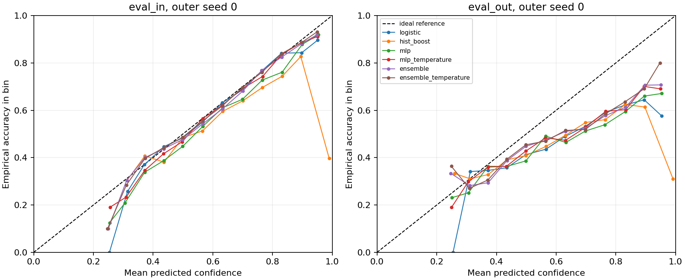
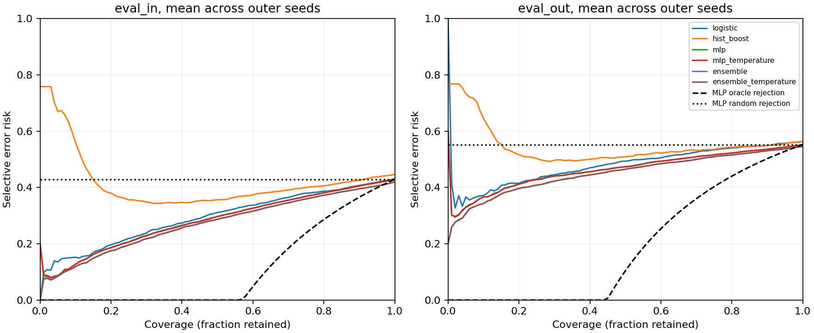

# Shifts Weather subset study

All numbers below were computed from this run's saved predictions.

## Protocol and provenance

- Code commit: `a6228dd203d60a168f8e11275a69f50811a5c26a`; dirty working tree: `False`.
- Package hash: `a59841cca859e83caaa01746094014271cd327053420edde4ec6b181eac1c6d9`.
- Prepared data hash: `de1056b3738b9fe0e698ac9f7baffe0b4857056f1edd82fea43c189a72bc6527`.
- Completed: 2026-10-06T09:25:29.481095+00:00.
- Python 3.12.14; scikit-learn 1.8.0; CPU threads: 1.
- Outer seeds: [0, 1, 2, 3, 4]; 3 neural fits per seed, 15 total.
- Separate validation, temperature-calibration, and conformal-calibration groups; no shifted-data tuning.
- float32 predictions, float64 evaluation; NLL clips true-class probabilities at 1e-15.

## Data support

| Split | Observations | Missing feature fraction |
| --- | ---: | ---: |
| train | 19987 | 0.0056 |
| eval_in | 4982 | 0.0047 |
| eval_out | 4992 | 0.0551 |
| validation | 1998 | 0.0053 |
| temperature | 1997 | 0.0060 |
| conformal | 1997 | 0.0054 |

Class codes are upstream numeric labels; no unverified human-readable class names are assigned.

| Class | Train | Validation | Temperature | Conformal | Eval in | Eval out |
| --- | ---: | ---: | ---: | ---: | ---: | ---: |
| 0 | 7553 | 728 | 753 | 808 | 1862 | 1486 |
| 10 | 6425 | 647 | 627 | 604 | 1582 | 1629 |
| 11 | 593 | 64 | 53 | 56 | 143 | 205 |
| 12 | 3 | 0 | 0 | 0 | 0 | 1 |
| 13 | 40 | 4 | 6 | 6 | 16 | 4 |
| 20 | 4537 | 479 | 489 | 436 | 1161 | 1392 |
| 21 | 699 | 63 | 58 | 79 | 172 | 257 |
| 22 | 11 | 1 | 0 | 1 | 4 | 4 |
| 23 | 126 | 12 | 11 | 7 | 42 | 14 |

Observation-key cleanup removed: `{'train': 13, 'dev_in': 8, 'eval_in': 18, 'eval_out': 8}`.
The retained samples have no shared exact time/latitude/longitude keys.
The candidate sampling was uniform over rows; cleanup does not make the retained sample uniform over unique stations.
Non-observational training rows excluded before sampling: 2.

## eval_in

MLP-based rows: mean ± sample SD over the outer optimization seeds, conditional on this one data subset.
Prior, logistic and hist_boost rows: one fit each, so a single value and no SD.

| Predictor | Accuracy | Macro F1 | NLL | ECE 15 | AURC | Set coverage | Set size |
| --- | ---: | ---: | ---: | ---: | ---: | ---: | ---: |
| prior | 0.3737 | 0.0605 | 1.3551 | 0.0042 | 0.6263 | 0.9243 | 3.0000 |
| logistic | 0.5686 | 0.2549 | 1.0564 | 0.0131 | 0.2933 | 0.8940 | 2.3302 |
| hist_boost | 0.5536 | 0.2350 | 2.2115 | 0.0987 | 0.4183 | 0.8904 | 2.6417 |
| mlp | 0.5712 ± 0.0064 | 0.2656 ± 0.0110 | 1.0424 ± 0.0059 | 0.0372 ± 0.0126 | 0.2824 ± 0.0024 | 0.8928 ± 0.0049 | 2.3036 ± 0.0281 |
| mlp_temperature | 0.5712 ± 0.0064 | 0.2656 ± 0.0110 | 1.0362 ± 0.0046 | 0.0176 ± 0.0058 | 0.2821 ± 0.0025 | 0.8939 ± 0.0055 | 2.3086 ± 0.0286 |
| ensemble | 0.5806 ± 0.0031 | 0.2709 ± 0.0062 | 1.0221 ± 0.0023 | 0.0210 ± 0.0055 | 0.2726 ± 0.0019 | 0.8930 ± 0.0042 | 2.2692 ± 0.0254 |
| ensemble_temperature | 0.5806 ± 0.0031 | 0.2709 ± 0.0062 | 1.0208 ± 0.0025 | 0.0161 ± 0.0036 | 0.2726 ± 0.0019 | 0.8930 ± 0.0043 | 2.2680 ± 0.0298 |

## eval_out

MLP-based rows: mean ± sample SD over the outer optimization seeds, conditional on this one data subset.
Prior, logistic and hist_boost rows: one fit each, so a single value and no SD.

| Predictor | Accuracy | Macro F1 | NLL | ECE 15 | AURC | Set coverage | Set size |
| --- | ---: | ---: | ---: | ---: | ---: | ---: | ---: |
| prior | 0.2977 | 0.0510 | 1.4175 | 0.0802 | 0.7023 | 0.9028 | 3.0000 |
| logistic | 0.4371 | 0.1957 | 1.2875 | 0.1096 | 0.4798 | 0.8419 | 2.4698 |
| hist_boost | 0.4365 | 0.1997 | 2.4487 | 0.1579 | 0.5481 | 0.8826 | 2.8628 |
| mlp | 0.4480 ± 0.0045 | 0.1909 ± 0.0072 | 1.2954 ± 0.0148 | 0.1194 ± 0.0117 | 0.4633 ± 0.0102 | 0.8482 ± 0.0053 | 2.4754 ± 0.0402 |
| mlp_temperature | 0.4480 ± 0.0045 | 0.1909 ± 0.0072 | 1.2711 ± 0.0082 | 0.0933 ± 0.0035 | 0.4631 ± 0.0101 | 0.8481 ± 0.0061 | 2.4712 ± 0.0402 |
| ensemble | 0.4543 ± 0.0022 | 0.1937 ± 0.0122 | 1.2562 ± 0.0097 | 0.0998 ± 0.0050 | 0.4511 ± 0.0058 | 0.8490 ± 0.0068 | 2.4365 ± 0.0310 |
| ensemble_temperature | 0.4543 ± 0.0022 | 0.1937 ± 0.0122 | 1.2486 ± 0.0060 | 0.0901 ± 0.0023 | 0.4511 ± 0.0058 | 0.8484 ± 0.0074 | 2.4324 ± 0.0347 |

## Paired NLL changes

Negative means lower NLL for the first method. These are descriptive seed differences, not significance tests.
hist_boost is a single fit, so the SD of its contrast reflects MLP seed variation only.

| Contrast | Domain | NLL change ± sample SD |
| --- | --- | ---: |
| ensemble minus mlp | eval_in | -0.0203 ± 0.0041 |
| ensemble minus mlp | eval_out | -0.0392 ± 0.0063 |
| ensemble_temperature minus ensemble | eval_in | -0.0013 ± 0.0008 |
| ensemble_temperature minus ensemble | eval_out | -0.0075 ± 0.0039 |
| hist_boost minus mlp | eval_in | +1.1691 ± 0.0059 |
| hist_boost minus mlp | eval_out | +1.1533 ± 0.0148 |
| mlp_temperature minus mlp | eval_in | -0.0062 ± 0.0036 |
| mlp_temperature minus mlp | eval_out | -0.0242 ± 0.0101 |

## Training diagnostics

Total recorded model fit time: 36.6 seconds on the recorded environment (not a hardware benchmark).
Selected MLP epochs range from 17 to 27.
Members that reached the epoch budget: 0/15.
Recorded fitting warnings: 0.

## Interpretation limits

- Prior, logistic and tree baselines were each fitted once. They carry no seed-to-seed SD, which says nothing about how stable they would be under a different data subset.
- Calibration set coverage targets 0.9 marginally under exchangeability; weather dependence and domain shift prevent an unconditional coverage guarantee here.
- Coverage can conceal failures for rare classes. Some class/domain cells have few or no examples; inspect per_class.csv, which leaves unsupported recall/coverage blank.
- Macro F1 uses the fixed full-training vocabulary, including classes absent from an evaluation sample (zero contribution).
- ECE depends on bins; metrics.csv also includes 10- and 30-bin estimates. NLL is the primary probability-quality comparison.
- AURC is mean selective 0–1 risk over retained counts. It is not the Shifts paper's error-replacement R-AUC; these numbers are not comparable to its leaderboard.
- Rejection curves average order within exact confidence ties. They are retrospective evaluations, not tuned deployment policies.
- The ensemble uses three fits and shares member zero with the single model; this controls architecture and pairing, not compute.
- One subset, fixed hyperparameters, few optimization seeds, no station-held-out validation, no novelty claim, and no broad superiority claim.

## Figures

## Re-evaluation

Run `shift-study evaluate --run <this-directory>` to verify prediction hashes, ensemble averaging, temperature transforms, and recompute metrics/figures without training.
The commit above is the code that trained the models and saved the predictions; the tables are what the currently installed evaluator computes from them.
Full metric values are in metrics.csv and summary.csv; paired_deltas.csv preserves each outer-seed difference.
risk_coverage.csv contains 101 display points per curve; AURC uses every retained count, reconstructible from the NPZ probabilities.
